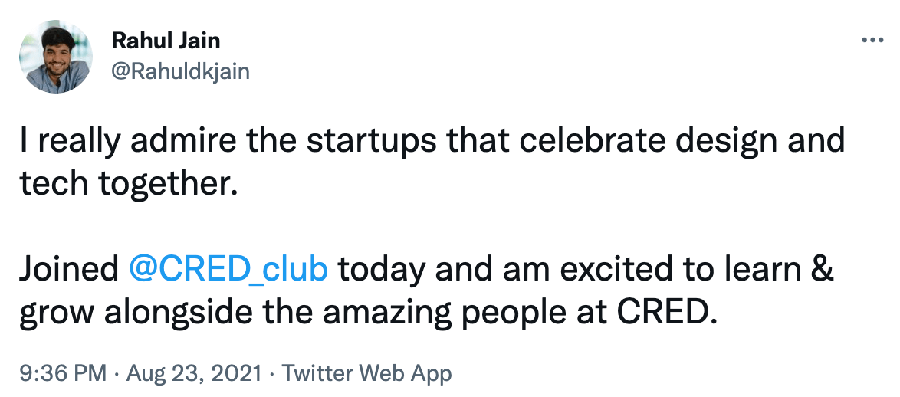
I tweeted this exactly an year ago. So yeah today marks my one year journey at CRED. After so many parties, releases, & an offsite, I can say it’s been an amazing journey in terms of personal and technical growth.

### Highlights

1. pay-tab(rent, education-fees & utility bill payments).
2. open Sourced [neopop-web](https://github.com/CRED-CLUB/neopop-web) component library on GitHub.

Super fortunate to work in such a great team that leaves no opportunity to make fun of each other apart from shipping great quality products. A team that pushes you to compound exponentially in becoming the best version of yourself. I feel that I have become more confident in asking questions, starting a conversation with anyone, shipping good quality products, and making fun of anybody (yes of course).

I am very bad at giving shoutouts but I think today is the day to break all the streaks.

A huge shoutout to the powerhouse of the team, **[Chirag Mittal](https://twitter.com/mittalchirag_)** for believing in me from the very start and giving me the opportunity to contribute to one of the best products in CRED. Thanks for coming up on all the quick calls to clear doubts, thanks for pushing me to develop the product mindset. I really admire his ability to think from first principles.

A big shoutout to the knowledge bank of the team, **[Tripurari Shankar](https://twitter.com/tripurari001)** for all the official, and unofficial Gurukul sessions, and for all the pseudo birthday parties that he sponsored.

A big shoutout to the greek god of the team, **[Amal Krishna](https://twitter.com/amalkrishna_t)** for all the guidance and 1:1 sessions to keep me moving forward.

A :party-parrot: shoutout to **[Tathagat Thapliyal 🇮🇳](https://twitter.com/tathagat2006)**, **[Aditya Sharma](https://twitter.com/sharmaadityaHQ)**, **[Abhishek Naidu](https://twitter.com/abhisheknaiidu)**, **[Utkarsh Gupta](https://twitter.com/Utkarsh9799_)**, **[Himanshu Satija](https://twitter.com/hdsatija)**, **[Yoginth S](https://twitter.com/yogicodes)**, **[Harish Kumar S S](https://twitter.com/harishkumar_s_s)**, **[Imanshu Rathore](https://twitter.com/ImanshuRathore)**, and **[Keerti Naik](https://twitter.com/naikkeerti20)** for keeping the fun alive at work.

A special shoutout to **[Ketan Jogani](https://twitter.com/ketan_jogani)**, for organizing great parties and building this great team to have fun and grow together.

Have been working with **[Divya Kant Singh](https://twitter.com/divyaftw)** right from the start and really enjoyed shipping features with him. I really admire his fearless attitude towards building great products. We have worked together on a few animation concepts as well. Kudos to all of that.

A big shoutout to **[Dharam Chauhan](https://twitter.com/dharamjchauhan)** as well for bringing stress-free moments while shipping time-critical features.

Well, this is just the beginning. Super excited about the cool products and features to come.

### Events

Here are the events and things that kept me growing:

- learnt how to debug and fix webview bugs in iOS.
- typescript, mobX
- react-spring animations
- BBPS: Utility Bill Payments
- CRED Poker League
- max NeoPOP revamp
- Profile page in NeoPOP
- Pay-tab
- FE Offsite
- All hands
- CRED 3 Year anniversary
- CRED Curios: Tanmay Bhatt
- Parties
- open sourced neopop-web
- Abby
- CRED Curios: Carl Pei
- CRED Badminton League
- Three.js POCs
- Max, BBPS Presentations

Onwards & Upwards 🚀

### Gallery

That's how the journey has been so far

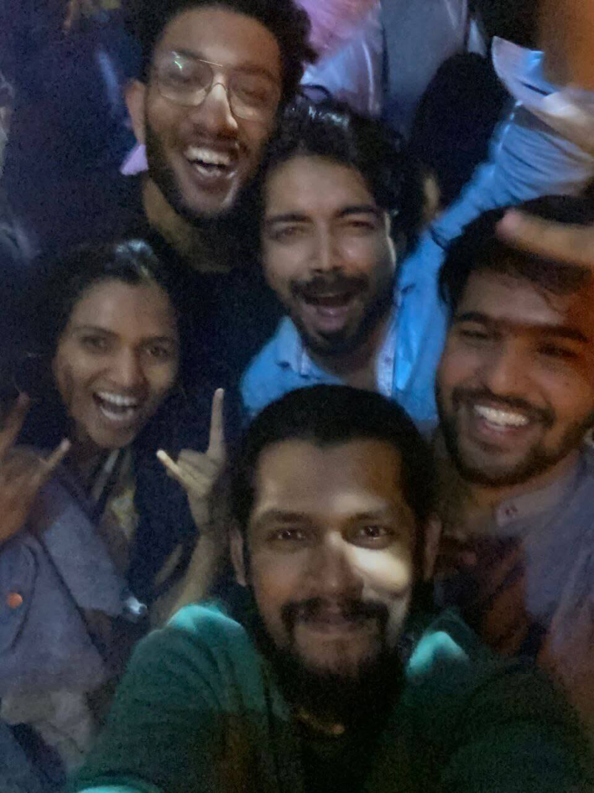
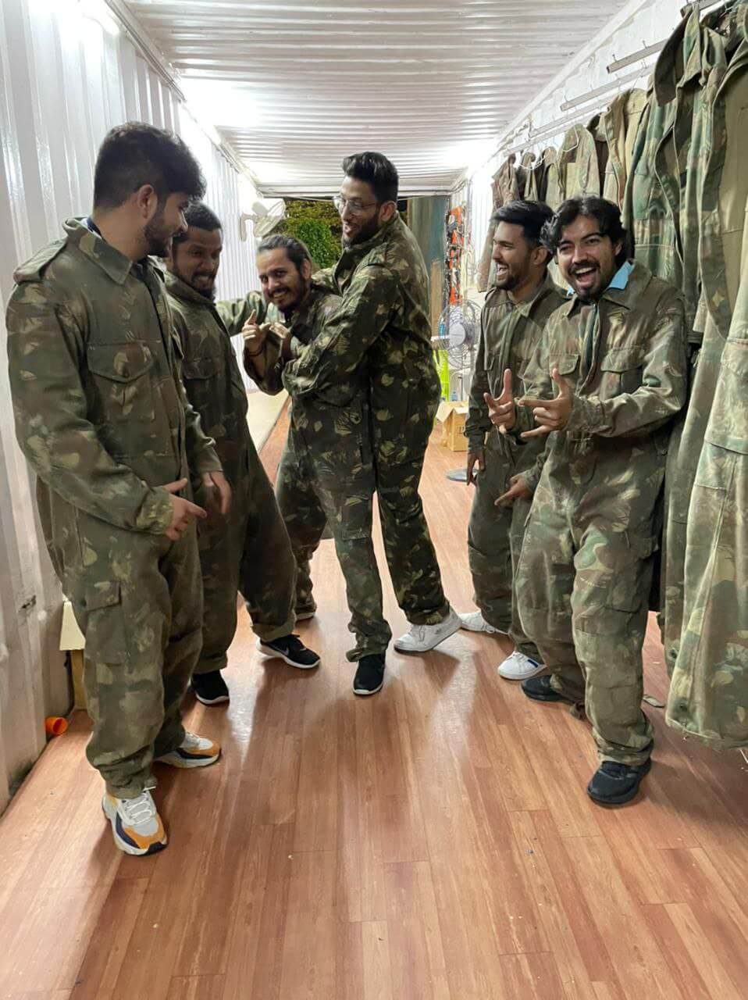
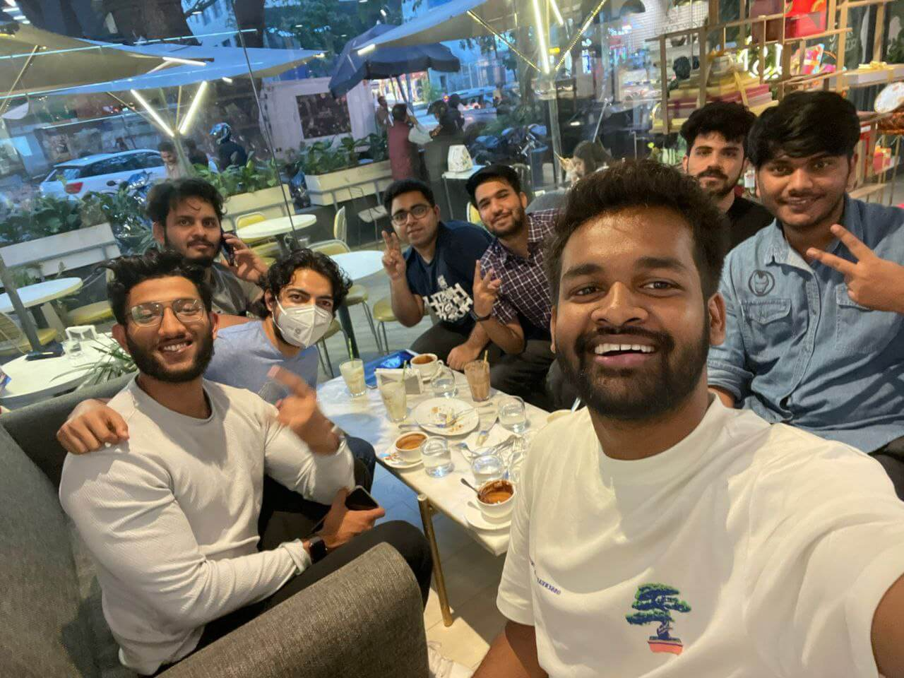

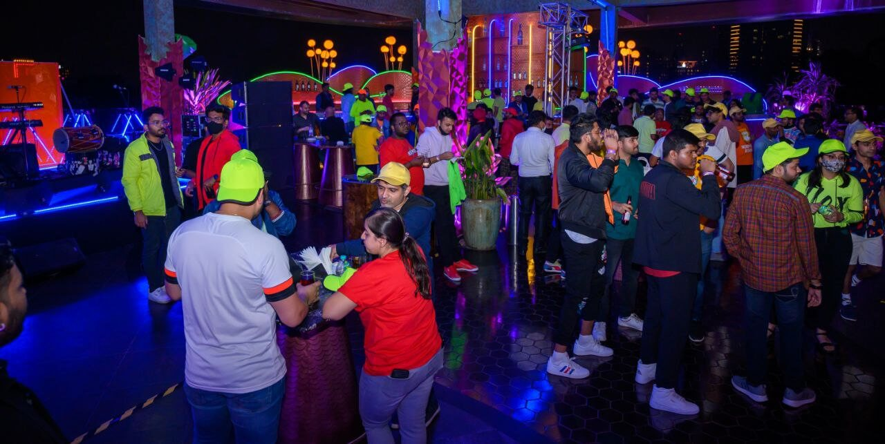
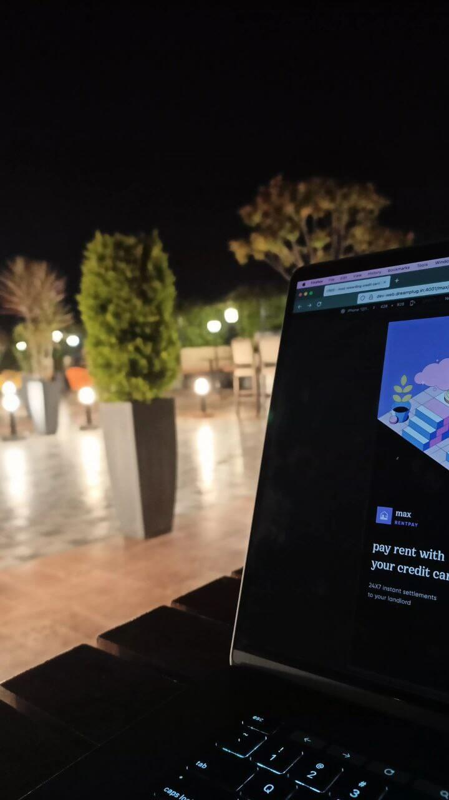
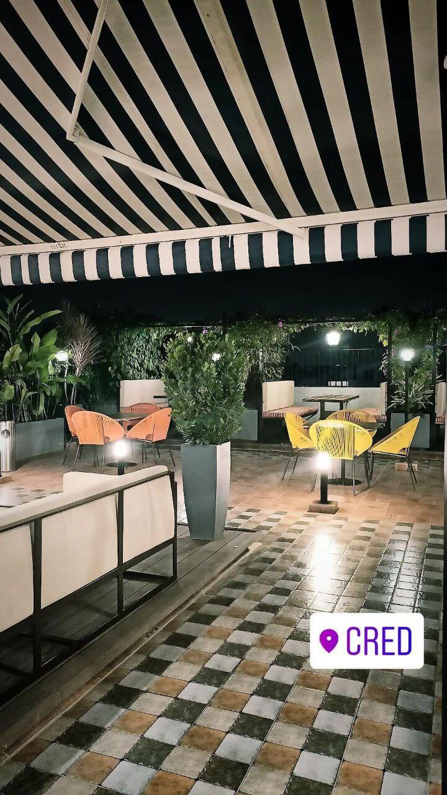
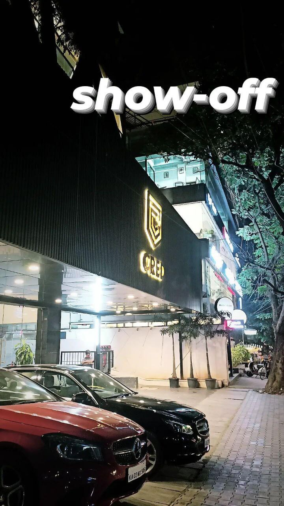
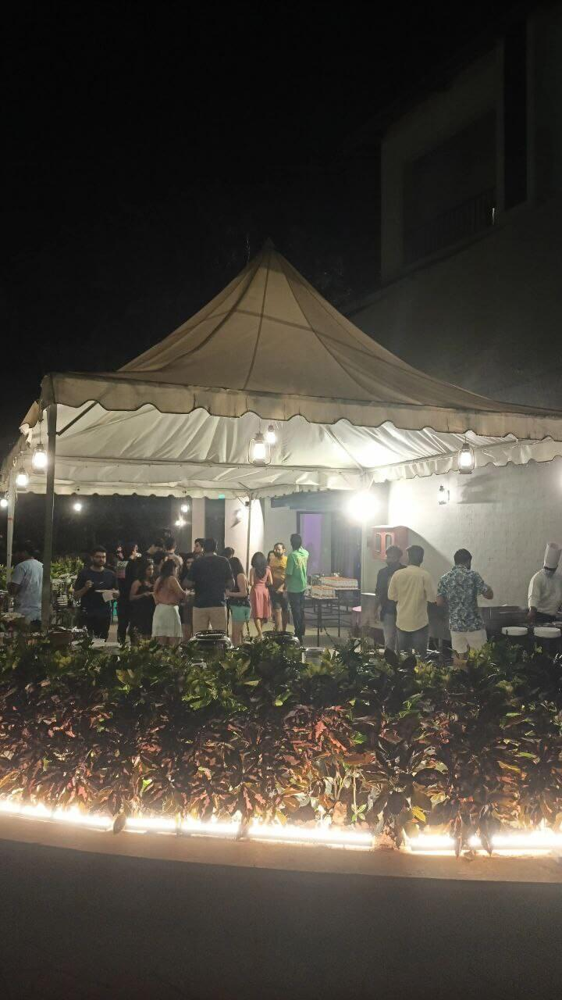
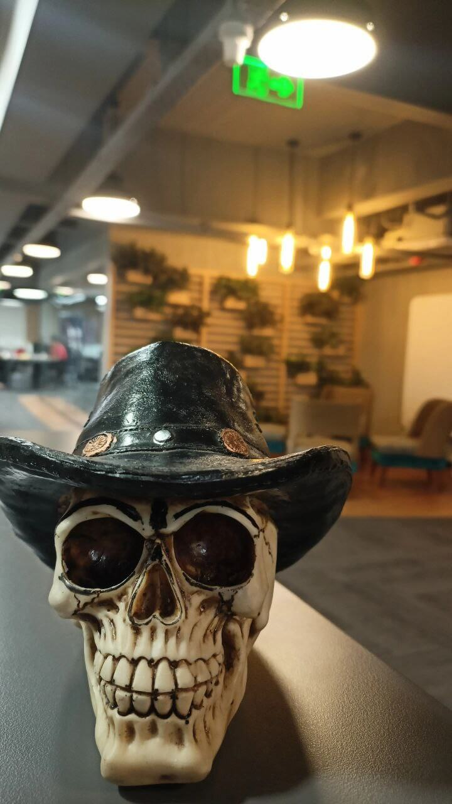
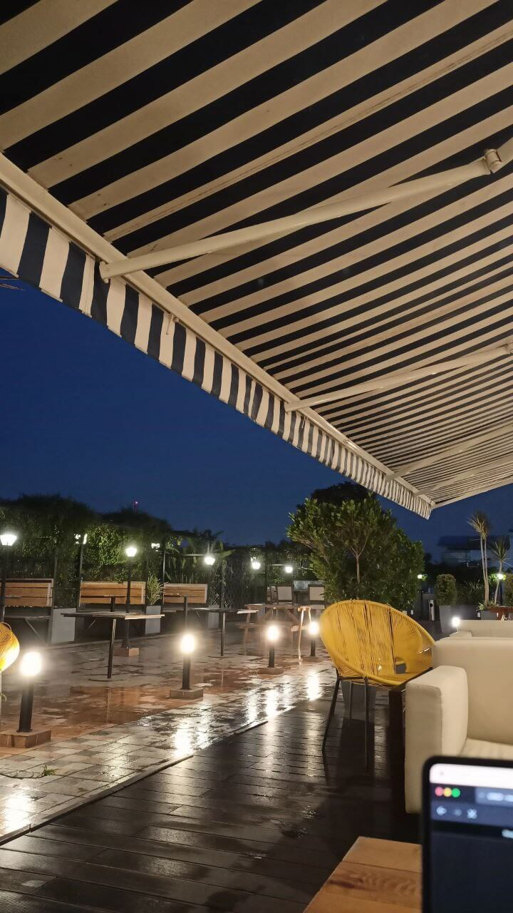
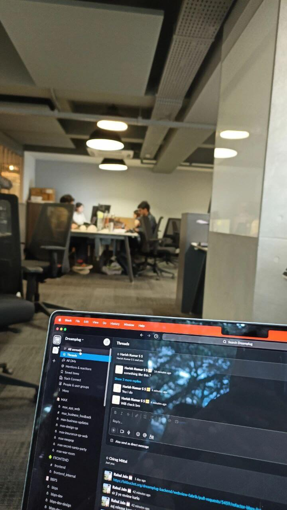
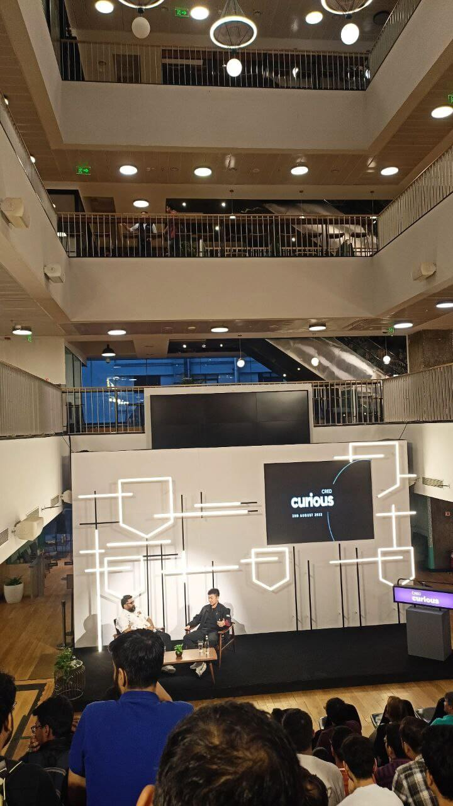
