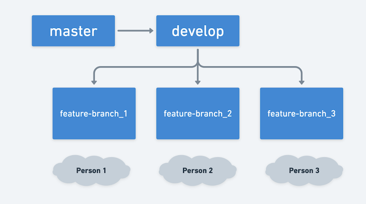
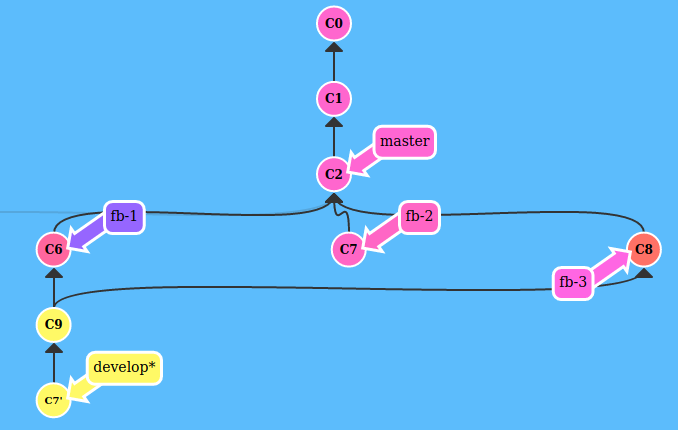

<p align="center"></p>
This is the current branching structure. 
For convenience, I am using the naming conventions as

```
fb-1: feature-branch_1
fb-2: feature-branch_2
fb-3: feature-branch_3
```
## Situation
I am currently working on `fb-2` whose base is off `develop` branch
The tip of `develop` branch got diverged after merging changes by other developers working in `fb-1` and `fb-3`.
<p align="center"></p>

## Challenge
I want to push the feature in `fb-2` to `master` branch via `develop` branch by raising pull request in such a way that changes from `fb-2` only gets merge with the master, without loosing other features from `develop` branch.

## Solution
1. To pick only `fb-2` changes in `develop`, I'll use use `cherry-pick`
```
git cherry-pick fb-2
```
<p align="center"></p>

2. Push the changes to remote repository
```
git push origin develop
```
3. Now, I'll raise a PR from `develop` to `master` 🚀.

4. To bring `develop` to its initial state
```
git reset HEAD^
``` 