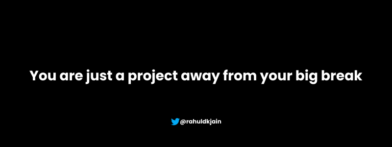
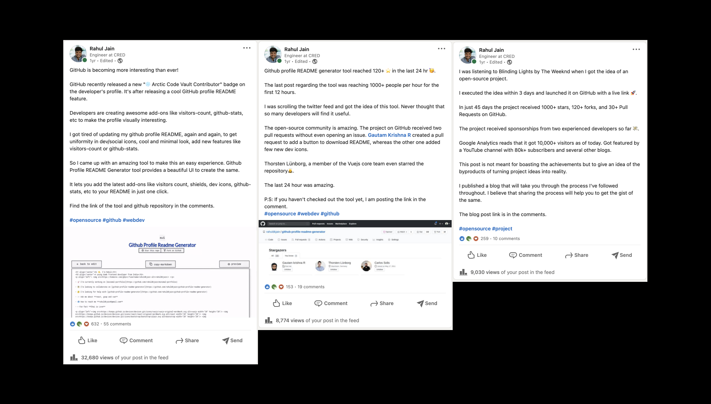

Hey there, I am glad you landed here to learn more about how to improve your GitHub profile and build trust. A good GitHub profile behaves as an effective marketing tool in selling yourself to potential clients or employers. I will try to explain all the ins and outs of having a good GitHub profile from my own experience.

First, I will walk you through my college journey so that you guys can easily relate, then I will try to answer all the related questions and inspirations that can come to your mind.

## My Journey

I am a 2020 graduate who didn't get the chance to attend the farewell and the convocation. My college started back in 2016. I had no clue of what I'll be doing in the next 4 years. I went there like a kora kagaz (blank sheet). I chose Physical Education in +2, so had no idea about programming. C, C++, Java & Python were just fancy creatures to me. As a result, I secured C grade in the C Programming course of 1st Semester 😝. Now you can picturize me as a young dumb kid who has no clue why he chose Computer Science & Engineering.

I saw some fancy hostel videos of IIT Bombay FilmMaking Club before joining the college and got excited to join the FilmMaking club. When I joined the club, the dean stopped giving funds. Our club has no camera and no future of course. Then I realized the importance of money. Coming from a low middle class background and an underdeveloped town of Rajasthan, I dropped the fancy idea of pursuing filmmaking. Let's get some money in the bank first 💰.

Just like everybody else, I started learning programming to get an internship. During the 2nd year summer break, I applied to a lot of companies from Internshala. Didn't get even a single response from the recruiters. I hated the idea of competitive programming and got really scared about cracking interviews without any CP. Desperate, I opened my account on [Freelancer](https://freelancer.com) to get any project of any domain. Developed & hosted a basic portfolio on GitHub pages and after struggling for about one week, I closed a deal to design a website for a US based client (\$3 per page). You can read the whole experience [here](https://dev.to/rahuldkjain/how-i-got-my-first-freelance-project-49c8).

From here onwards, I didn't stop exploring. I applied for Eklavya IIT Bombay program by completing the animation assignments using [three.js](https://threejs.org/) , but didn't make it because of the pointers(grades).

I participated in all the hackathons organized by college's programming club and that's how they went:

| Hackathon              | Year     | Experience                                                                                                                                                                                                      | Result      |
| ---------------------- | -------- | --------------------------------------------------------------------------------------------------------------------------------------------------------------------------------------------------------------- | ----------- |
| Vassar Lab's Hackathon | 2nd Year | Registered only for the free Maggi & coffee.                                                                                                                                                                    | Participant |
| IBM Watson Hackathon   | 3rd Year | Participated along with 3 batch-mates, contributed in documentation                                                                                                                                             | 1st Place   |
| Chatbot Hackathon      | 3rd Year | All India Level Hackathon organized by [Swaniti](https://www.swaniti.com/) on HackerEarth. Built a [chatbot](https://github.com/jainsomya972/jaano-india-chatbot) with [Somya](https://github.com/jainsomya972) | AIR 2       |
| IBM AI/ML Hackathon    | 4th Year | Registered with the mindset of winning                                                                                                                                                                          | Runner Up   |

I was able to secure an on-campus internship offer from [Coviam](https://www.quinbay.com/) (now Quinbay). This happened because of the confidence in myself that I can grab the offer without doing any competitive programming. That confidence came from doing projects, and exploring different things.

I cracked the on-campus placements while working in Coviam (7th semester) and got the full time offer from [Zolo](https://zolostays.com/).

Then lockdown happened. All the big plans of hanging out with friends in the last semester didn't happen.

I graduated in May 2020 and my joining was from September 2020. The period from May to September was where the magic happened.

I started learning React.js and became a regular user of twitter. I followed all the famous personalities on tech twitter whom I admire and started reading their tweets on a day to day basis.

On one fine day in the second-last week of May 2020, GitHub launched a new feature of creating your profiles in markdown like [this](https://github.com/rahuldkjain). I saw several developers made some really cool addons like adding github-stats, visitors count etc. [GitHub Readme Stats](https://github.com/anuraghazra/github-readme-stats) developed by [Anurag Hazra](https://github.com/anuraghazra) went viral in just couple of days. Then the idea of creating [GitHub Profile README Generator](https://github.com/rahuldkjain/github-profile-readme-generator) came to my mind.

I started working on the MVP(Minimum Viable Product) without even thinking about how good or bad the idea is.

I coded the project in just 2 days and hosted it on GitHub pages. I started writing articles on how to use the amazing tool to create beautiful GitHub profile READMEs in few minutes with cool addons. In just couple of weeks, people started noticing and liking the project. I didn't stop. I cross-linked the repository on various popular articles in the comments. You can learn more about how to promote your open-source project [here](https://rahuldkjain.github.io/blog/how-github-profile-readme-generator-reached-200+-stars-on-github/). My post on Linkedin about this project gained a lot of tractions and in just couple of weeks, the project had 1000+ stars.

I didn't stop.

I subscribed to free 6 months [FrontendMasters](https://frontendmasters.com/) courses using GitHub pro. Learned "SVG Animations" from [Sarah Drasner's](https://twitter.com/sarah_edo) course and wrote a few articles about GSAP Animations on my blog and dev[.]to .

I created an account on Fiverr to sell `SVG Animations`. I researched about this particular keyword on Fiverr and found out a huge potential in the gigs. So I created few gigs and started getting orders.
From charging $10 per animation to $75 per animation, I became a level 2 seller in just couple of months. You can checkout some of my animations [here](https://rahuldkjain-animations.vercel.app/)

On a very good day, a client from Sweden reached out to me on Fiverr to create a website for his product ([DoseMedbox](https://dosemedbox.com/)) to sell online. I closed the deal, worked for 1.5 months and launched it.

I didn't stop.

I realized that I need to `surround myself with people who are way better than me` to grow rapidly. So here I am working as a Frontend Engineer at CRED who is known for their design, app-dev and marketing.

Phew! That was a long story isn't it. Thanks for bearing me. Now I assume that you already have the answers to the perks of having a good GitHub profile.

## Perks of a good GitHub profile

To simplify things, I am listing down the things again for you:

- Trust
- Freelance Projects
- Higher chances of landing a job interview
- Passive Income through GitHub sponsors, BuyMeACoffee, & Paypal etc.

## How to improve GitHub profile?

I hope you are convinced now to improve your GitHub profile that opens up a huge world of opportunities. So I am listing down the things that helped me improving my GitHub profile:

- **Good profile picture**: It gives a sense of authenticity.
- **Good bio**
  - Twitter handle
  - Portfolio link
  - Email (Optional)
- **Good profile README**: You can use [GitHub Profile README Generator](https://github.com/rahuldkjain/github-profile-readme-generator)
- **Good projects**: The most important part of the profile
- **Good contributions**: merge commits on popular projects work as wonder

## Tips & Tricks

- Create beautiful READMEs of your projects
- Lookout for issues on the open-source projects that you like
- Write and publish articles on your favourite topics
- Participate in hackathons and start building projects
- Participate in Hackoberfest ofcourse
- Join a community
- Follow good developers on GitHub
- Enhance your online presence

## Important Links

I am sharing a list of resource that helped me:

- [Javascript.info](https://javascript.info/): best JS tutorials on the internet(opinion)
- [Namaste Javascript Playlist](https://www.youtube.com/watch?v=pN6jk0uUrD8&list=PLlasXeu85E9cQ32gLCvAvr9vNaUccPVNP&ab_channel=AkshaySaini): to understand the fundamentals of JS and crack interviews
- [Awesome FrontendMasters List](https://github.com/rahuldkjain/awesome-frontendmasters): best resources from great educators
- [Learn Git](https://learngitbranching.js.org/): gamified git tutorials
- [hiring-without-whiteboards](https://github.com/poteto/hiring-without-whiteboards): very helpful while looking out for jobs
- [My Portfolio Source code](https://github.com/rahuldkjain/rahuldkjain.github.io): portfolio helped me landing a job at CRED

## Conclusion

`You are just a project away from your big break`
